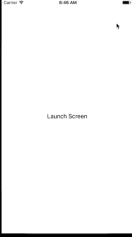

# AppProtectionDemo

## What does it do?

Think of an app that displays banking, health or insurance data, for example. Depending on the national law of your target market, it may be critical to not store/show sensitive userdata in the app when the user is not using it. Also, you'll might need to implement an optional password protection.

The App Demo shows how to (hopefully) properly implement the requirements so you can adapt it to fit your needs.

### Features
- works with and without activated password protection
- without password: app shows lock screen and removes the lock screen automatically when the app comes back to foreground
- with password: app protects sensitive data with the password protection screen when the app is being deactivated, removes the password protection screen automatically when the app is reactivated but wasn't deactivated and takes care to ask for a password when the app was in background before being activated
- takes care to not store sensitive data in screenshots iOS takes when the user single/double-taps the app

## Demo

